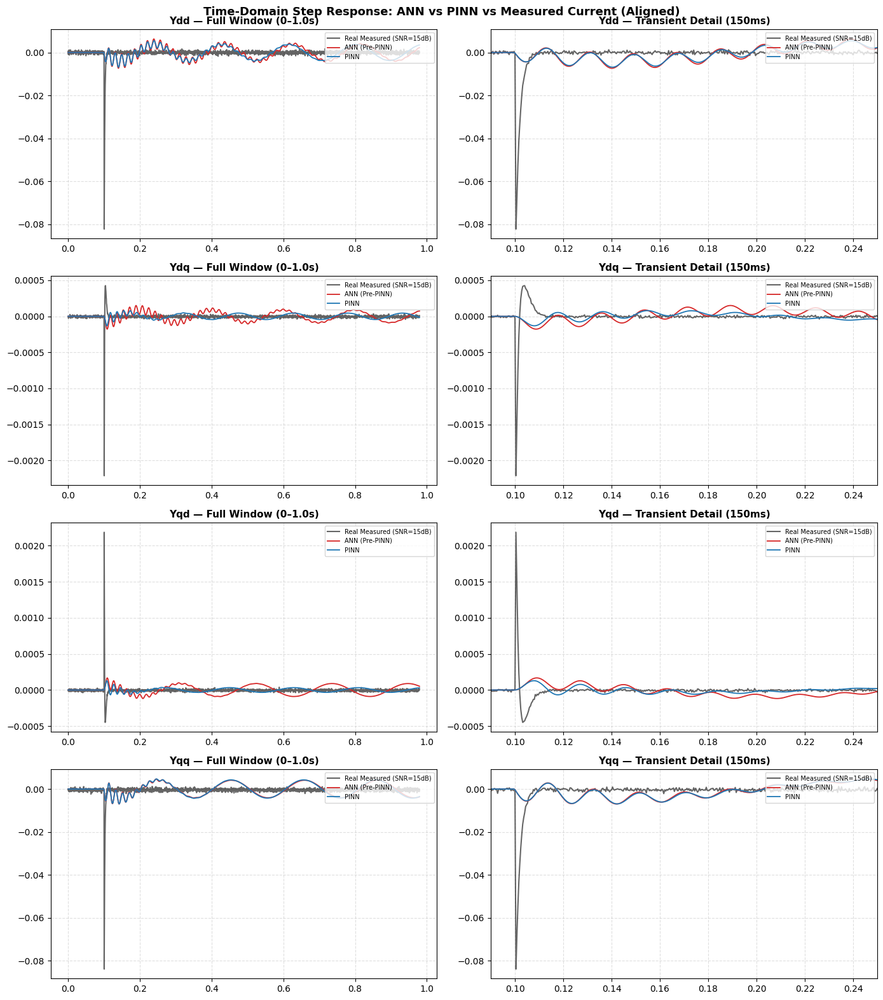
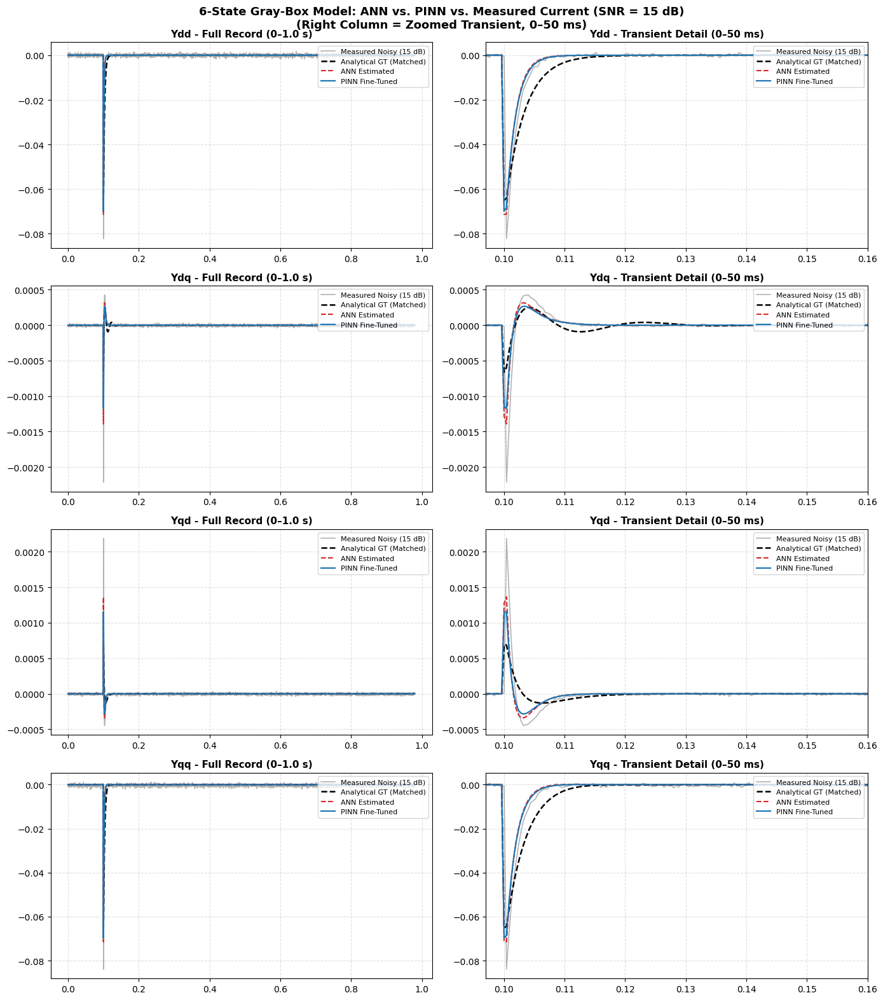

# Noise-Robust Admittance Identification of Grid-Connected VSCs

Machine-learning-based identification of the 2×2 dq-frame admittance of grid-connected Voltage Source Converters (VSCs) from short, noisy time-domain measurements.

This repository contains the code, data generators and report of a research internship carried out at **KAUST** (Power Electronics and Control Systems), supervised by **Prof. Charalambos Konstantinou** and **Mr. Zaint Alexakis**.

> Full write-up: [`docs/internship_report.pdf`](docs/internship_report.pdf)

---

## Contents

- [Overview](#overview)
- [Project story](#project-story)
- [Repository structure](#repository-structure)
- [Two physical models](#two-physical-models)
- [Notebooks](#notebooks)
- [Quick start](#quick-start)
- [Datasets](#datasets)
- [Results](#results)
- [Known limitations](#known-limitations)
- [References](#references)
- [License](#license)

---

## Overview

Converter manufacturers do not disclose control structures or parameters, so the admittance of a VSC at its point of common coupling (PCC) has to be identified as a black box. Around an operating point, the small-signal behaviour is captured by

```
[ΔI_d(s)]       [Y_dd(s)  Y_dq(s)] [ΔV_d(s)]
[ΔI_q(s)]  = -  [Y_qd(s)  Y_qq(s)] [ΔV_q(s)]
```

Once `Y_dq(s)` is known, converter–grid stability can be assessed with the Generalized Nyquist Criterion without an internal model of the converter.

Classical time-domain identification (ERA, DMD) is fast but degrades sharply under measurement noise. This project investigates whether a neural network can learn a noise-robust mapping from short step-response windows to admittance information.

## Project story

The work has two phases.

**Phase 1 — Reproduction.** The physics-informed neural network (PINN) method of Zhang, Xu and Wang (IEEE Trans. Industrial Electronics, 2023) was reproduced from first principles, because no official code accompanies the paper. This covers the analytical small-signal model, the restructured three-layer network, the offline/online transfer-learning procedure, and the dense/sparse case studies (VSC I → VSC II). The analytical model was checked against a Simulink switching model.

**Pivot.** The reproduction showed that the paper's architecture-embedded physics acts mainly as a data-efficient replacement for FFT-based frequency-response extraction, is tied to the assumed control topology, and does not evaluate measurement noise. After discussion with the supervisor, the project moved to a time-domain, noise-robust approach in which physics is used for label generation and not for shaping the network.

**Phase 2 — Noise-robust identification.** Two pipelines were implemented in Python/PyTorch, trained on MATLAB-generated step-response data:

| Pipeline | Network output | Notebook |
|---|---|---|
| **Gray-box** | Physical parameters `L_f, R_f, K_p_i, K_i_i, K_p_pll, K_i_pll, I_d_eq, I_q_eq`, then admittance via the known state-space model. ANN estimator followed by PINN fine-tuning. | `03_graybox_parameter_pinn.py` |
| **Black-box** | Stable pole–zero parametrization of each of `Y_dd, Y_dq, Y_qd, Y_qq` (degree-6 transfer functions, stable by construction). ANN followed by PINN fine-tuning through a differentiable modal simulation. | `02_blackbox_tf_identification.py` |

Both are evaluated across SNR levels (clean to 5 dB), against five noise profiles (Gaussian, pink, uniform, AR(1), impulsive), and in a data-scarcity regime (150 vs 3,000 training systems). The black-box pipeline is compared against ERA.

## Repository structure

```
vsc-admittance-identification/
├── README.md
├── requirements.tx
├── docs/
│   ├── internship_report.pdf
│   └── figures/
│   
├── matlab/
│   ├── model/                      # analytical admittance model and helpers
│   ├── utils/                      # shared helpers (sensor noise)
│   ├── data_generation/
│   │   ├── zhang2023/              # tabular admittance datasets → notebook 01
│   │   └── timedomain/             # step-response datasets → notebooks 02, 03
│   ├── simulink/                   # switching + average VSC models, injection script
│   ├── validation/                 # analytical sanity checks and sweeps
│   └──legacy/                     # earlier generator revisions (kept for traceability)
│   
├── notebooks/
│   ├── 01_paper_reproduction.py
│   ├── 02_blackbox_tf_identification.py
│   └── 03_graybox_parameter_pinn.py
├── data/
│   └── README.md                   # dataset documentation and regeneration guide
└── results/
```

## Two physical models

The repository uses two different plant models. Keep them apart when reading the code.

1. **Frequency-domain analytical model** — `matlab/model/analytical_model.m`.
   Evaluates the closed-loop admittance `Y(jω)` of Zhang et al. (L filter, PI current loop, digital delay, SRF-PLL) at a given frequency and operating point. It is built from `filter_models.m` and `pll_tf.m`, and was compared with the Simulink switching model. It generates the **tabular datasets for notebook 01**.

2. **6-state time-domain state-space model** — states `[i_d, i_q, ξ_d, ξ_q, θ_pll, ξ_pll]`, inputs `[V_d, V_q]` (grid-voltage perturbation, global dq frame), outputs `[i_d, i_q]`. It is used by the generators in `matlab/data_generation/timedomain/` to simulate voltage-step responses and exact ground-truth admittances. It generates the **datasets for notebooks 02 and 03**.

The perturbation is always a **voltage step** and the current is the **response**, which matches the definition `Y(s) = I(s)/V(s)`.

## Notebooks

| Notebook | Purpose |
|---|---|
| `01_paper_reproduction.py` | Reproduction of Zhang et al. (2023): dataset inspection (paper Figs. 9, 11), restructured 3-layer PINN (`LayerIFrequencyBranch`, `LayerIIOperatingCombiner`, `LayerIIIDecoder`), conventional-ANN baselines (unified vs element-specific), offline training on VSC I, and online transfer to VSC II with a three-tier strategy (simple fine-tuning, gradual unfreezing, TCA alignment). |
| `02_blackbox_tf_identification.py` | Black-box pipeline: per-component `ComponentModel`, stable pole–zero parametrization, Bode validation across SNR, noise-profile generalization, PINN fine-tuning via `tf_to_modal_ss_batch`, scarce-data models. |
| `03_graybox_parameter_pinn.py` | Gray-box pipeline: `PhysicsParameterNet`, ANN stage then PINN fine-tuning, zero-shot noise-profile evaluation, physics-loss-weight sweep, data-scarcity benchmark. |

The notebooks were developed in Google Colab and read their datasets from zip archives. Set the data path at the top of each notebook. Archive names are listed in [`data/README.md`](data/README.md).

## Quick start

### 1. Python environment

```bash
git clone https://github.com/touti24/vsc-admittance-identification.git
cd vsc-admittance-identification
python -m venv .venv
source .venv/bin/activate          # Windows: .venv\Scripts\activate

```

### 2. Get the data

Either download the prepared archives (link in [`data/README.md`](data/README.md)), or regenerate them in MATLAB:

```matlab
cd matlab
addpath(genpath(pwd))

% Notebook 01 (tabular admittance datasets)
run('data_generation/zhang2023/gen_vsc1_dense_dataset.m')
run('data_generation/zhang2023/gen_vsc2_sparse_and_dense_datasets.m')

% Notebooks 02 and 03 (time-domain step responses)
run('data_generation/timedomain/gen_train_vsc_family_3000.m')
run('data_generation/timedomain/gen_train_vsc_family_scarce150.m')
run('data_generation/timedomain/gen_ref_vsc_stepresponse.m')
run('data_generation/timedomain/gen_test_noise_profiles.m')
```

Required MATLAB products: base MATLAB and Control System Toolbox. The Simulink scripts also need Simulink and Simscape Electrical.

### 3. Run a notebook

Open the notebook in Colab or Jupyter, point it to the extracted data folders, and run the cells in order.

## Datasets

Nine datasets are used. The full description (file formats, parameter ranges, seeds, SNR definition, noise-profile definitions) is in [`data/README.md`](data/README.md).

| Dataset | Used by | Content |
|---|---|---|
| `vsc1_dense_dataset.csv` | 01 | Dense admittance grid for VSC I, 1–100 Hz × 20–80 A |
| `vsc2_sparse_dataset1.csv` | 01 | 200 random noisy operating points for VSC II |
| `vsc2_dense_dataset1.csv` | 01 | Clean 100 × 51 validation grid for VSC II |
| `training_data_out5` | 02 | 6-state VSC family, SNR 30/20/10/5/∞ dB |
| `training_data_out777` | 03 | 3,000-system 6-state VSC family |
| `training_data_out_worse_quality` | 02, 03 | 150-system scarce set |
| `vsc_data_out4` | 02 | VSC I reference at I_d = 50 A, SNR 30 to 5 dB and clean |
| `vsc_data_out777` | 02, 03 | VSC I reference, second revision |
| `vsc_data_noise_profiles_out1` | 02, 03 | Five noise profiles at 15 dB (test only) |

## Results

The values below are taken from the internship report. Figures are in `docs/figures/`.

**Black-box identification, RMS magnitude error (dB) vs ANN and ERA**, averaged over 1–100 Hz:

| Method | 30 dB | 20 dB | 15 dB | 10 dB | 5 dB |
|---|---|---|---|---|---|
| Proposed ANN | 0.28 | 0.54 | 0.86 | 1.34 | 2.18 |
| ERA baseline | 0.35 | 0.89 | 1.82 | 3.65 | 6.42 |

**Gray-box data-scarcity benchmark** (150 vs 3,000 training systems): transient RMSE of 0.00742 for the PINN-fine-tuned estimator against 0.01240 for the ANN-only estimator, a 40.2 % reduction.

**Noise-profile generalization** (trained on Gaussian noise only, tested at 15 dB): the black-box error rises from 0.86 dB (Gaussian, `Y_dd`) to 1.45 dB for impulsive noise. The gray-box parameter estimates stay close to the ground truth across all five profiles.





## Known limitations

- All noise experiments use synthetic noise. Validation against measured lab-equipment noise is outstanding.
- The training sets in `training_data_out5`, `training_data_out777` and the scarce set are VSC parameter families (±50 % around VSC I, with randomized operating points). A generic random-linear-system generator (`gen_train_random_linear_systems.m`) is provided but is not part of the notebooks' main experiments.
- Generalization to VSC II in the time-domain pipeline uses a simplified VSC II model. A broader set of unseen converter topologies is needed to support structure-agnostic claims.
- GNC-based stability validation and hardware-in-the-loop experiments from the original paper were not reproduced.
- Simulink models (`VSC1_switching.slx`, `VSC1_average.slx`) were saved in MATLAB release `<R2024b>`.


Reproduced method:

> M. Zhang, Q. Xu, and X. Wang, "Physics-Informed Neural Network Based Online Impedance Identification of Voltage Source Converters," *IEEE Transactions on Industrial Electronics*, 2023.


## License

Released under the `<MIT>` License. See [`LICENSE`](LICENSE).
